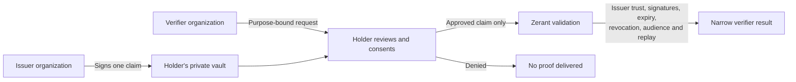
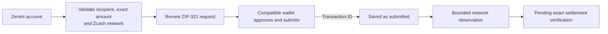
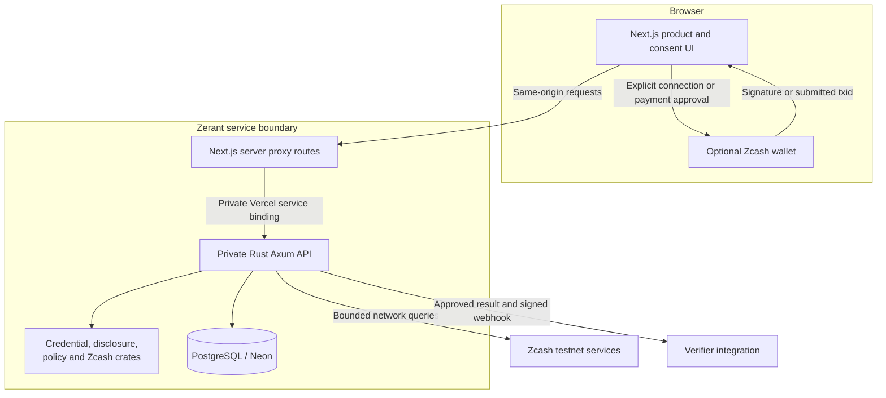

# Zerant Protocol

**Prove trust. Preserve privacy.**

Zerant is a trust and credential layer for applications in the Zcash ecosystem. An organization issues a signed statement to a person's private Zerant vault. Another organization can request one specific fact, and the holder decides whether to disclose it. Zcash payments are a separate action: Zerant prepares and tracks a request, while a wallet keeps the spending keys and asks for its own approval.

Zerant is running on **Zcash testnet**. A Zerant ID (`zr_…`) is an account identifier, not a payment address or a record of wallet activity. A passkey is sufficient to use credentials; connecting a wallet is optional until the user chooses a wallet action.

## How it works



The verifier receives the approved result, not the holder's credential collection. A credential is meaningful within its issuer, claim, and context; Zerant does not calculate a public reputation score. The current proof mechanism uses signed minimal disclosures and separate atomic attestations. It is **not** a zero-knowledge or anonymity system.

Payments follow a different authority path:



A wallet-returned transaction ID means **submitted**, not paid or settled. The hosted testnet observer can report network status and confirmation depth for a named transaction, but it cannot independently prove a shielded recipient and exact amount. Zerant does not issue a verified payment claim from that status alone. The normal payment flow uses a reviewed ZIP-321 link or QR code without a browser wallet connection. A simple single payment also shows the exact recipient and amount for manual entry in a testnet wallet; richer requests retain the complete link.

For organization payouts, a holder can separately share a **temporary private payout destination**. Zerant validates that it is shielded-capable on the configured Zcash network, encrypts the address and purpose under a payout-specific envelope-encryption domain, and reveals it only to authorized operators of the selected issuer organization while an active trust relationship exists. An authorized operator can enter the amount directly on that private payout record; Zerant decrypts the destination server-side, creates the canonical ZIP-321 request, and saves the normal prepared-payment record without placing the private address in a URL. The address expires after seven days or can be withdrawn earlier; expiry, trust revocation, and trust expiry scrub the encrypted secret. A payout destination is not a Zerant identity attribute, credential claim, spending authorization, or custodial account.

## Architecture



The browser holds transient wallet connection state. The private service owns sessions, authorization, encrypted credential records, issuer and verifier workflows, payment records, and proof validation. The Zcash integration crate owns Zcash parsing and observation boundaries. Neither the browser nor the wallet becomes a general credential authority.

### Repository layout

```text
apps/web/                 Next.js product, public pages, components, server proxy routes
services/zerant-api/      Private Rust/Axum API, PostgreSQL persistence and migrations
crates/zerant-core/       Identifiers, canonicalization and common validation
crates/zerant-credential/ Signed credentials, issuer trust and revocation
crates/zerant-policy/     Contextual policy evaluation
crates/zerant-disclosure/ Requests, consent-bound responses and replay rules
crates/zerant-zcash/      Addresses, ZIP-321, payments and Zcash network boundaries
docs/                    Architecture, privacy, threat model and protocol specs
fixtures/                Shared protocol fixtures
scripts/                 Validation and operational helpers
```

The main workspace routes are `/app`, `/vault`, `/requests`, `/activity`, `/zcash`, `/issuer`, `/verifier`, and `/account`. Long operational areas use direct routes: `/zcash/payments`, `/zcash/invoices`, `/zcash/payouts`, `/zcash/wallet`, `/zcash/address`; `/issuer/team`, `/issuer/schemas`, `/issuer/issue`, `/issuer/payouts`, `/issuer/security`, `/issuer/activity`; and `/verifier/requests`, `/verifier/integrations`, `/verifier/security`. `/issuers` is the public issuer directory; `/pay/[id]` displays a bounded public invoice request. A public invoice does not identify its owner or certify payment.

## Wallet access on testnet

Noir Wallet has separate mainnet and testnet extension builds. Zerant can detect an installed Noir provider without receiving account authorization. Selecting it explicitly calls Noir's interactive connection method; Zerant accepts a returned account only if its addresses match the configured testnet. A detected mainnet extension cannot be switched into testnet by Zerant. The [Noir developer guide](https://docs.zknoir.com/developers/) explains how to obtain the official testnet build.

Wallet connection does not sign in to Zerant, approve a proof, or authorize spending. Wallet sign-in uses a separate challenge and signature when supported. A ZEC payment requires separate wallet approval. A validated ZIP-321 request can also be handed to a compatible testnet wallet without a live browser connection. Zerant never requests a seed phrase, spending key, wallet balance, or transaction history for identity.

### What the Zcash building blocks mean

| Building block | Role in Zerant | Current boundary |
| --- | --- | --- |
| Zcash wallet/developer RPC | Private service-side readiness, capability discovery and narrowly bound observation | Never exposed to the browser; an RPC response is not settlement proof |
| ZIP-321 payment URI | Portable payment handoff containing the exact reviewed recipient, amount and optional memo | Supported now; the complete request is preserved and handed to a compatible wallet |
| PCZT | A reviewable transaction package boundary for future wallet and shared-approval work | Parsed or documented where supported; not a Zerant spending key or settlement claim |
| FROST | Future shared approval for an organization or treasury | Not a live Zerant signing product; no shares are stored in the credential vault |
| Account abstraction | A possible future wallet product, not an identity shortcut | Zerant IDs do not control funds; making them spend would require an explicit custodial or smart-wallet design |

Zerant does not depend on WalletConnect. Direct browser adapters are optional. The reliable fallback is to review the request in Zerant and open or copy its ZIP-321 URI in a compatible Zcash testnet wallet.

## Run and verify

Use Node **22.x** and pnpm **10.34.6** for the web workspace. Rust tooling and a PostgreSQL database are needed for the private service; see [deployment and configuration](docs/VERCEL_DEPLOYMENT.md) for its server-only settings.

```bash
pnpm install --frozen-lockfile
pnpm --filter @zerant/web dev

pnpm --filter @zerant/web test
pnpm --filter @zerant/web lint
pnpm --filter @zerant/web typecheck
pnpm --filter @zerant/web build

cargo fmt --all -- --check
cargo clippy --workspace --all-targets -- -D warnings
cargo test --workspace
python3 scripts/secret-check.py
```

For a browser-level wallet regression check, run `node scripts/browser-wallet-smoke.mjs https://zerant.vercel.app`. It launches an isolated browser with a simulated Noir provider to verify passive discovery, one interactive request, rejection handling, and wrong-network rejection. It does not replace an approval test with the real Testnet Noir extension.

The deployed web app reaches the Rust backend through private Vercel service binding and same-origin `/api/zerant/*` routes. Do not put database, RPC, or key configuration in `NEXT_PUBLIC_*`. The health endpoint is `/api/zerant/health`.

## Privacy and limits

Zerant stores credentials and workflow state on the server under its existing envelope encryption architecture. It keeps Zerant identity separate from wallet addresses and limits verifier results to the approved claim. Active private payout destinations use a distinct encryption domain, are organization-scoped, are included in holder data export while active, and are scrubbed on withdrawal or expiry. Issuer honesty, device compromise, traffic correlation, and coercion remain outside what signed minimal disclosure can solve. Pairwise identifiers reduce obvious cross-application linking but do not guarantee unlinkability.

The production configuration remains on **testnet**. Network readiness is not a payment receipt. Exact shielded settlement verification for hosted testnet payments requires an authorized recipient-side observation path and is not currently asserted by Zerant. PCZT and FROST code marks capability boundaries; it is not a live shared-control signing product.

For the detailed security contracts, read [architecture](docs/ARCHITECTURE.md), [protocol](docs/PROTOCOL.md), [privacy](docs/PRIVACY.md), [threat model](docs/THREAT_MODEL.md), [wallet compatibility](docs/WALLET_COMPATIBILITY.md), and [Zcash integration](docs/ZCASH-INTEGRATION.md).
