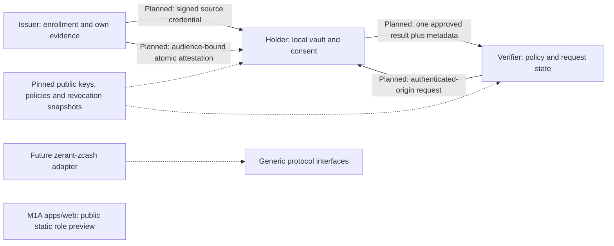

# Zerant Protocol

**Prove trust. Preserve privacy.**

Zerant explores privacy-preserving credentials and contextual reputation for developer ecosystems. An issuer attests to evidence it can substantiate; a holder chooses what to disclose; a verifier asks for one narrowly defined result. The goal is useful eligibility checks without collecting a holder’s complete history.

## Why Zerant

Grant programs, OSS communities, hackathons and accelerators may need evidence of eligibility, not an applicant’s entire credential portfolio. Zerant’s proposed protocol separates private source evidence from audience-bound atomic attestations. Reputation is attached to an explicit context and immutable policy, never a universal social score.

Holders remain free in the product thesis. Future B2B infrastructure and integration support are possible; hosted services, pricing and product-market fit are not current commitments. Revenue must not depend on selling holder profiles.

## Current status

**M1B: Rust credential core implemented.** `apps/web` remains a static product preview, while `crates/zerant-core` and `crates/zerant-credential` now implement strict signed-payload parsing, atomic credential verification, issuer trust, audience/expiry checks, and signed revocation snapshots. The holder vault, key-possession enrollment, contextual reputation engine, disclosure/replay engine, Zcash integration, and ZK remain unimplemented.

The protocol documents include both implemented M1B contracts and planned M1C/M2 requirements. MUST/MUST NOT language is only an implemented guarantee where the corresponding Rust code and tests exist. Zerant has not yet completed the [full M1 acceptance criteria](docs/scope/milestone-01.md).

## Architecture



The public web shell plus the Rust core/credential boundaries are implemented. Reputation, disclosure, SDK and Zcash boundaries remain planned. Generic credentials and reputation must not depend on wallet state. See [architecture decisions](docs/ARCHITECTURE.md) and [protocol overview](docs/PROTOCOL.md).

## Planned M1 flow

1. Issuer authenticates enrollment and signs private source evidence. Holder validates and encrypts it locally.
2. Holder evaluates the pinned contextual policy locally. The issuer independently evaluates its own evidence.
3. Issuer provisions a separate audience-bound attestation for the fixed supported predicate before a verifier requests it.
4. Verifier persists a signed single-result request with authenticated origin, challenge, nonce and expiry.
5. Holder reviews the exact result, purpose, origin, issuer, validity and all outbound metadata. Approval is request-specific. Denial emits no response.
6. Holder signs an approved response under the attestation’s audience key. Verifier checks signatures, trust, policy, subject possession, validity, revocation and request bindings, then atomically consumes the request.

M1 uses separately signed atomic attestations, **not zero knowledge or redaction of a signed multi-claim credential**. A holder-computed score alone cannot establish a verified threshold. Missing evidence must fail closed rather than disclose source credentials.

## Privacy requirements and limits

Credential authenticity, issuer authorization, audience/expiry validation, and revocation checks are implemented in M1B. Holder vault privacy, consent transport, reputation evaluation, response signing, and replay persistence remain M1C requirements.

| Intended requirement | Limit |
| --- | --- |
| Private source credentials remain local; only one matching attestation is returned | The verifier sees the result and necessary metadata, including audience key, credential/revocation IDs, issuer/key/schema/policy and timestamps |
| Threshold disclosure excludes the exact score and inputs | The predicate outcome leaks information; issuer evaluation must be trusted |
| Independent audience keys and fresh identifiers reduce obvious correlation | No anonymity or unlinkability guarantee; same-audience reuse, rare claims, timestamps, IP/account data and issuer/verifier collusion can correlate |
| Explicit single-request consent; denial sends no response | A user can still approve a revealing predicate; device compromise defeats local consent integrity |
| Encrypted local vault, no default server sync | Future encryption cannot protect an unlocked vault from malicious same-origin code, weak passphrases or a compromised device |
| Bound requests and durable replay checks | These require authenticated transport and persistent atomic state; neither exists yet |

No generic wallet addresses, balances or transactions are part of the response. Zcash’s transaction privacy does not automatically apply to Zerant credentials. Read [privacy](docs/PRIVACY.md) and [threat model](docs/THREAT_MODEL.md) before making claims or designing integrations.

## Repository structure

```text
apps/web/
  public/brand/             Provisional original SVG mark and wordmark
  src/app/                 App Router landing page, /demo, styles and icon
  src/components/          Role dashboard, consent panel and UI button
  src/lib/                 Typed public demo fixtures and class utilities
  components.json          shadcn/ui-compatible aliases and CSS configuration
docs/
  ARCHITECTURE.md           Trust boundaries and load-bearing decisions
  PROTOCOL.md              Proposed M1 lifecycle and encoding
  PRIVACY.md               Required invariants and non-guarantees
  THREAT_MODEL.md           Threats, mitigations and residual risks
  ROADMAP.md                Phased milestones
  scope/milestone-01.md     Full M1 scope and acceptance criteria
  specs/                   Credential, disclosure and reputation drafts
PRODUCT.md                 Product thesis and initial wedge
DESIGN.md                  Consent principles, tokens and typography
pnpm-workspace.yaml        Workspace definition
vercel.json                Static-export hosting and clean route URLs
```

`crates/zerant-core` and `crates/zerant-credential` are implemented. The remaining Rust crates and `packages/sdk` are still planned. No unused component library, query cache, database or crypto library is installed. The local button and utility structure support adding shadcn/ui components when needed.

## Local setup

Use Node.js **22.13+** (a supported LTS release is recommended) and pnpm **10+**. No environment variables, external services or remote fonts are required.

```sh
# With pnpm available on your PATH:
pnpm install
pnpm dev
```

Open `http://localhost:3000`, then `/demo`. If pnpm is unavailable, install it using your normal package-manager setup or use `npm exec --yes --package=pnpm -- pnpm install`. This requires registry access.

Dependencies are pinned to the stable versions resolved by pnpm: Next.js 16.3.8, React 19.3.0 and Tailwind CSS 4.3.3. ESLint 9.39.2 and TypeScript 5.9.3 stay within the supported lint-tool peer ranges. `pnpm-lock.yaml` records the full graph; use frozen installs for CI and deployment.

## Scripts

Run from the repository root:

| Command | Purpose |
| --- | --- |
| `pnpm dev` | Start the web development server |
| `pnpm build` | Build and statically export `apps/web/out` |
| `pnpm lint` | Run ESLint with Next.js and TypeScript rules |
| `pnpm typecheck` | Run strict TypeScript checks |
| `pnpm test` | Test consent rendering against disclosure boundary assertions |

Before submitting a change:

```sh
pnpm install
pnpm lint
pnpm typecheck
pnpm test
pnpm build
```

The consent test checks visible request identity, exact predicate, withheld categories and correlation metadata. It does not test cryptography or replace keyboard, screen-reader and responsive browser verification.

### Validation status for this scaffold

The scaffold includes a resolved lockfile and consent rendering test. In the authoring sandbox, a full install encountered a read-only global pnpm store; an offline lockfile-only install passed and validation used available workspace dependencies. Run a full frozen install in your deployment environment. Build validation uses the supported Webpack path (`next build --webpack`) because the authoring sandbox blocks the internal sockets required by Turbopack. Lint, strict typecheck, the consent test and production static export passed. Next.js uses the TypeScript compiler API with pinned TypeScript 5.9. Browser and Vercel deployment checks remain separate from build validation.

## Deployment to Vercel

M1A exports public static assets. No server runtime or secrets are required, and publishing the shell does not deploy a protocol verifier.

1. Install dependencies with the checked-in lockfile and run all checks above.
2. Import this repository into Vercel. Set **Root Directory** to the repository root, not `apps/web`.
3. The root `vercel.json` selects the **Other** framework preset for this explicit static-export setup: install command `pnpm install --frozen-lockfile`, build command `pnpm build`, output directory `apps/web/out`, and clean URLs so `/demo` resolves to its exported HTML. Keep these defaults.
4. Choose a supported Node.js LTS runtime compatible with the resolved Next.js version. No environment variables are needed.
5. Deploy and confirm `/`, `/demo`, the icon and `/brand/zerant-mark.svg` load on both desktop and mobile. Check keyboard tabs, disclosure details, decline/approval preview labels and system dark mode.

The source build path is configured; no Vercel deployment has been performed or verified. Future authenticated protocol transport requires separate architecture/security decisions. Do not add secret data to static fixtures or build output.

## Roadmap

- **M1A:** Complete — visual/product shell, consent preview, workspace and docs.
- **M1B:** Credential core implemented — strict Rust credential/trust/revocation verification. Encrypted vault and holder proof-of-possession remain pending.
- **M1C:** Contextual reputation, authenticated consent/disclosure, durable replay and revocation.
- **M2:** Separately scoped Zcash testnet identity adapter and real integration.
- **M3:** Research into stronger privacy predicates and anonymous credentials; no stronger guarantees before review and implementation evidence.

See [the roadmap](docs/ROADMAP.md). There are no committed release dates.

## Security and development principles

Do not use the public M1A preview for real eligibility decisions or enter real credentials into it. The web examples remain illustrative; the M1B Rust credential verifier is a local protocol component, not a deployed trust service.

Before protocol implementation, document trust boundaries, cryptographic profiles, subject binding, consent, key lifecycle, storage, replay, revocation and retention in the architecture document. Use maintained libraries and interoperable test vectors; do not invent cryptography or silently substitute a protocol. Never send a whole credential portfolio to simplify verification.

Future acceptance must cover denied/unrequested disclosure, threshold leakage, domain substitution, tampering, expiry, revocation, compromise and concurrent/restarted replay. Holder secrets must stay outside SSR, analytics, logs and shared caches.

A private security reporting channel is **not yet available**. Do not publish sensitive exploit details or secrets in public issues; arrange a private maintainer contact before sharing them. No security audit is claimed.

## Contributing

Read [AGENTS.md](AGENTS.md), the product/design documents and the relevant protocol specs first. Keep changes scoped, preserve others’ work, and clearly distinguish specified, previewed and implemented behavior. Update architecture before changing a load-bearing contract. Favor accessible semantic controls, light/dark parity and reduced motion. Do not add backend services or wallet dependencies to the generic protocol without a scoped task.

Run the root validation scripts and document remaining limits. The provisional logo requires final review. No license has been selected in this repository; a license and contribution terms are **pending**, so do not assume redistribution rights from this README.

## Project links

- [Product thesis](PRODUCT.md) · [Design](DESIGN.md) · [Roadmap](docs/ROADMAP.md)
- [Credential spec](docs/specs/credential-v0.1.md) · [Disclosure spec](docs/specs/disclosure-v0.1.md) · [Reputation spec](docs/specs/reputation-v0.1.md)
- Hosted demo: **not yet available**
- Published SDK / package: **not yet available**
- Final brand assets, security contact and license: **pending**
