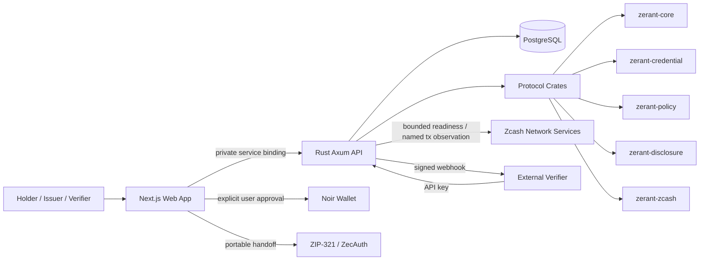

# Zerant Protocol

**Prove trust. Preserve privacy.**

Zerant is a privacy-preserving trust layer for Zcash applications. Organizations can issue trusted credentials, holders keep those credentials private, and applications request only the specific fact they need instead of collecting a holder's full identity, credential history, wallet address, balance, or transaction history.

Zerant separates **identity**, **consent**, and **payment authority**. A Zcash wallet is optional for account access, but wallet approval is required when a user chooses to perform a Zcash payment.

## Why Zerant

Most trust systems over-collect data. A verifier that only needs to know whether a user is eligible may end up storing a name, wallet address, account history, unrelated credentials, and payment activity.

Zerant changes that flow:

1. **Issuer** creates and signs a credential.
2. **Holder** receives it under a Zerant ID and keeps it private.
3. **Verifier** requests one narrow claim with a stated purpose.
4. **Holder** reviews the exact request and approves or denies it.
5. **Zerant** returns a short-lived verifier-specific result.
6. **Zcash payment**, when required, is approved separately in the user's wallet.

There is no universal reputation score and no wallet-wide identity profile.

## Hackathon build

The current build includes:

- private credential issuance and holder vaults;
- contextual verifier requests with explicit consent;
- issuer organizations, roles, invitations, key rotation, revocation, and audit history;
- verifier API keys and signed webhook delivery;
- passkey-based account access;
- optional Zcash wallet authentication;
- Noir Wallet injected connection on Zcash testnet;
- ZIP-321 payment request validation and portable wallet handoff;
- direct shielded wallet payment when the connected adapter advertises that capability;
- saved payment state and exact transaction-ID submission tracking;
- Zcash testnet network readiness and bounded transaction observation;
- shareable account-owned Zcash invoices.

The project intentionally does **not** claim zero knowledge, anonymity, full unlinkability, production-grade mainnet settlement verification, or live FROST signing where those mechanisms are not implemented.

## Product surfaces

| Surface | Purpose |
| --- | --- |
| `/vault` | Holder credentials, Zerant ID, and account access |
| `/issuer` | Issuer organization, credential types, issuance, revocation, and team governance |
| `/issuers` | Public issuer and credential-definition discovery |
| `/verifier` | Register a verifier and create narrow proof requests |
| `/requests` | Holder review and consent inbox |
| `/zcash` | Zcash wallet connection, payment preparation, invoices, and payment state |
| `/app` | Product workspace and current account overview |
| `/pay/[id]` | Public shareable Zcash invoice request |

## Architecture



### Trust boundaries

- **Browser:** product UI, consent, wallet selection, and transient wallet connection state.
- **Rust service:** durable account state, credential storage, authorization, server challenges, replay protection, and verifier workflows.
- **Protocol crates:** canonical parsing, signatures, policy evaluation, disclosure binding, and Zcash request validation.
- **Wallet:** holds spending keys and authorizes every payment action.
- **Verifier:** receives only the approved result for its request.
- **Database:** stores encrypted credentials and durable workflow state, never wallet seed material.

See [docs/ARCHITECTURE.md](docs/ARCHITECTURE.md) for the full implementation architecture.

## Zcash wallet model

Zerant does not make a wallet the user's identity.

### Account access

A user can access Zerant with a passkey. Zcash wallet sign-in is optional and can be linked separately.

### Wallet connection

For an installed Noir Wallet, Zerant uses the Noir SDK:

- `zcash_requestAccounts` for an explicit user-initiated connection;
- `zcash_getAccounts` only for silent restoration of an existing authorization;
- `zcash_signMessage` with a derived signing key for the supported identity flow;
- `zcash_sendTransaction` for a direct payment when the wallet advertises the required capability.

The browser never reads wallet history to establish identity.

### Payments

A payment is a separate capability:

1. Zerant validates the recipient and amount.
2. Zerant constructs or validates the canonical ZIP-321 request.
3. The user reviews the exact request.
4. The user either approves it in a connected wallet or opens the portable request in another compatible wallet.
5. A wallet-returned transaction ID is stored as **submitted**, not automatically treated as settled.

This distinction is deliberate: **wallet submission is not settlement proof**.

## Privacy model

Zerant minimizes what crosses each boundary:

- credentials are not public profile fields;
- denial returns no credential result;
- verifier requests are purpose-, audience-, nonce-, and expiry-bound;
- proofs are verifier-specific;
- wallet balances and transaction history are not used as identity;
- the service stores only the Zcash payment records a user explicitly prepares in Zerant;
- a submitted transaction ID is tracked independently from credential identity.

Credential records are encrypted at rest behind a versioned key-provider boundary. The current deployment is server-readable for authorized product operations, so Zerant is **not** holder-only end-to-end encrypted.

Read [docs/PRIVACY.md](docs/PRIVACY.md), [docs/THREAT_MODEL.md](docs/THREAT_MODEL.md), and [SECURITY.md](SECURITY.md).

## Repository structure

```text
apps/web/                  Next.js product UI and API proxy routes
services/zerant-api/       Rust/Axum authenticated service
crates/zerant-core/        IDs, canonicalization, origin/time rules
crates/zerant-credential/  Credential signing, trust, revocation
crates/zerant-policy/      Deterministic contextual policy evaluation
crates/zerant-disclosure/  Requests, holder responses, replay binding
crates/zerant-zcash/       Zcash parsing, readiness, payment observation
docs/                      Architecture, protocol, privacy, wallet and integration docs
fixtures/                  Deterministic and sanitized integration fixtures
scripts/                   Local checks and Zcash regtest helpers
```

## Local development

Requirements:

- Node.js **22.x**
- pnpm **10+**
- Rust toolchain
- PostgreSQL for authenticated server workflows

```bash
pnpm install
pnpm dev
```

Then open:

```text
http://localhost:3000
```

The public shell can render without all external services. Authenticated credentials, issuer/verifier workflows, and durable payments require the Rust service and PostgreSQL.

## Verification

Web:

```bash
pnpm --filter @zerant/web typecheck
pnpm --filter @zerant/web test
pnpm --filter @zerant/web build
```

Full repository gate:

```bash
make check
```

Zcash regtest integration helpers are explicit and never run against mainnet:

```bash
make z3-check
make integration
```

## Deployment

Zerant deploys as one Vercel project:

- Next.js customer application;
- private Rust/Axum container service;
- Neon PostgreSQL.

The web app reaches the Rust service through a private Vercel service binding. Deployment variables and key-rotation procedures are documented in [docs/VERCEL_DEPLOYMENT.md](docs/VERCEL_DEPLOYMENT.md).

## Demo

Use [docs/DEMO.md](docs/DEMO.md) for the exact judging flow, screenshot checklist, and demo-video script.

Recommended short demo path:

1. Sign in with a passkey.
2. Open the Vault and show a private credential.
3. Create a verifier request.
4. Review the request as the holder and approve only the requested claim.
5. Show the verifier receiving the narrow result.
6. Open Zcash, prepare a payment, connect Testnet Noir, and approve the wallet action.
7. Show Zerant recording the returned transaction ID as submitted/pending verification.
8. Show a shareable invoice link.

## Documentation

- [Architecture](docs/ARCHITECTURE.md)
- [Demo and screenshot runbook](docs/DEMO.md)
- [Protocol](docs/PROTOCOL.md)
- [Privacy](docs/PRIVACY.md)
- [Threat model](docs/THREAT_MODEL.md)
- [Account access](docs/ACCOUNT_ACCESS.md)
- [Wallet compatibility](docs/WALLET_COMPATIBILITY.md)
- [Zcash integration](docs/ZCASH-INTEGRATION.md)
- [Verifier integration API](docs/VERIFIER_INTEGRATION_API.md)
- [Verifier webhooks](docs/VERIFIER_WEBHOOKS.md)
- [Deployment](docs/VERCEL_DEPLOYMENT.md)

## Current limitations

- Zcash testnet is the active development network.
- Mainnet direct wallet execution is not the hackathon target.
- A wallet-returned transaction ID proves submission, not exact shielded settlement.
- Exact shielded recipient/amount confirmation requires an authorized observation path.
- PCZT/FROST remain capability-gated boundaries; Zerant does not implement custom threshold cryptography.
- Stronger unlinkable credential constructions and managed KMS/HSM custody remain future work.

## License and contribution

This repository is the active Zerant hackathon implementation. Security-sensitive changes should preserve the documented consent, replay, revocation, wallet-authority, and privacy boundaries rather than bypass them for convenience.
