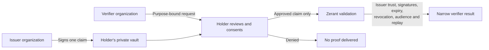
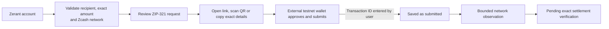
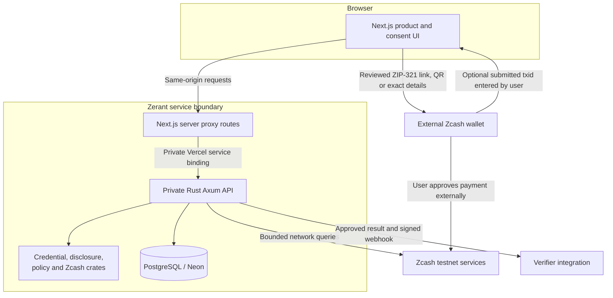
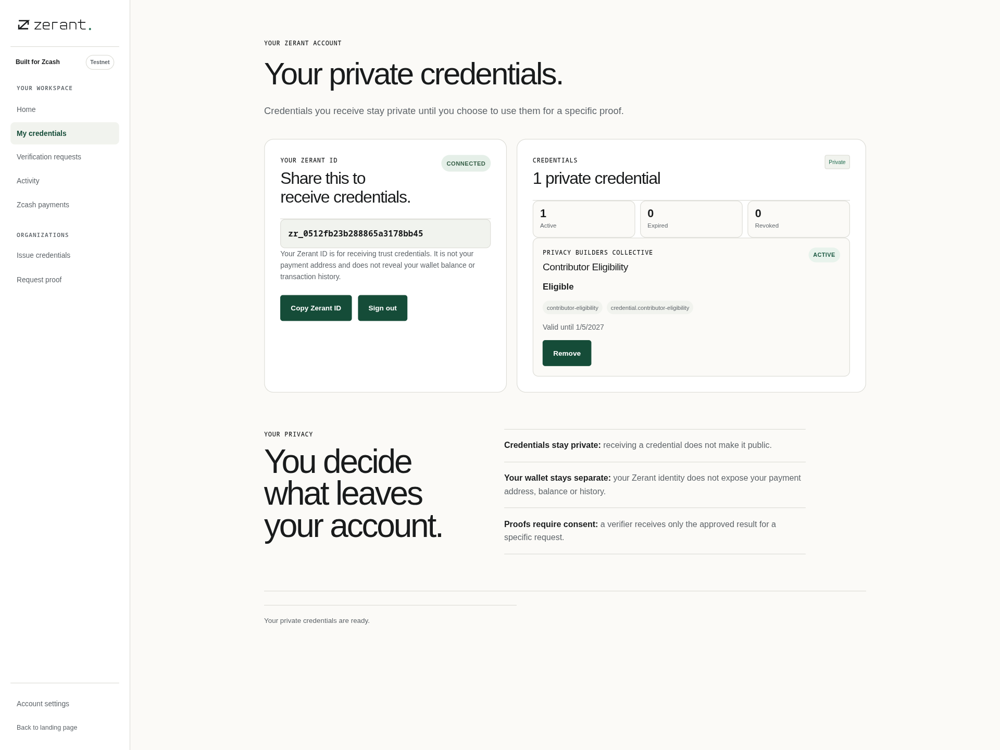
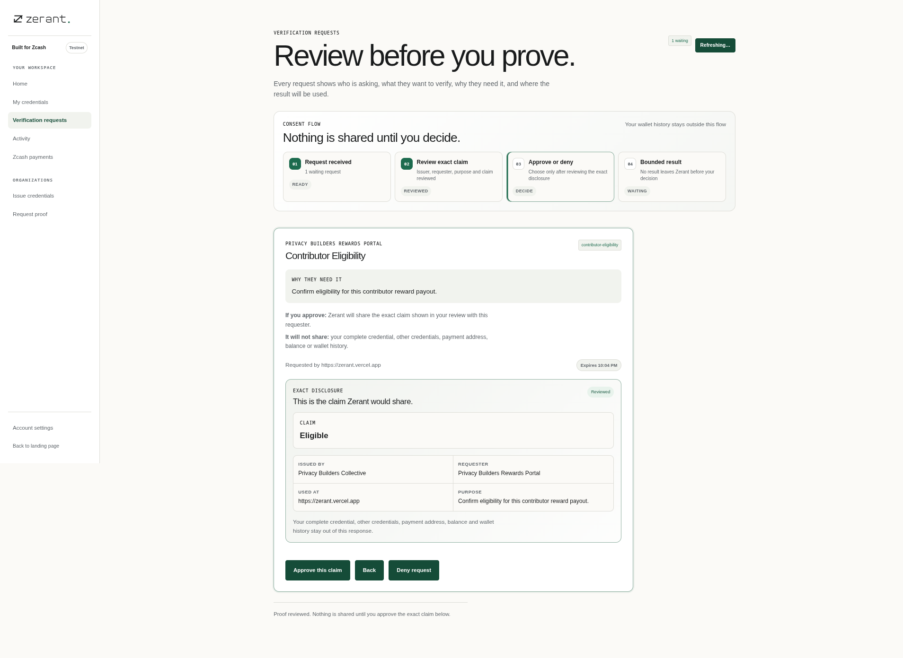
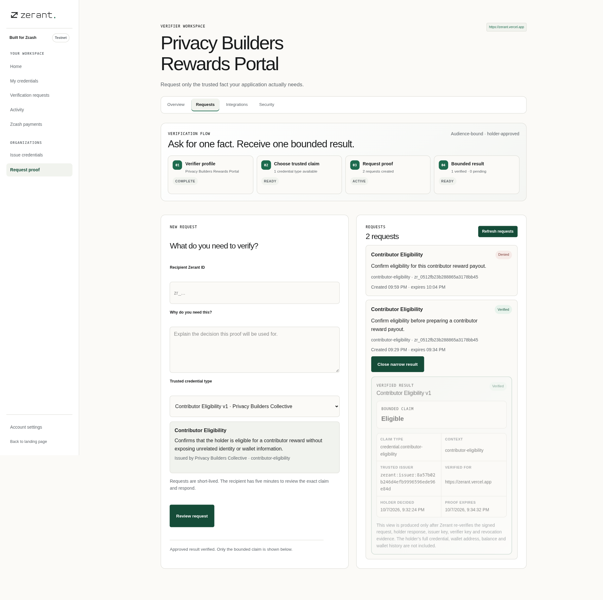
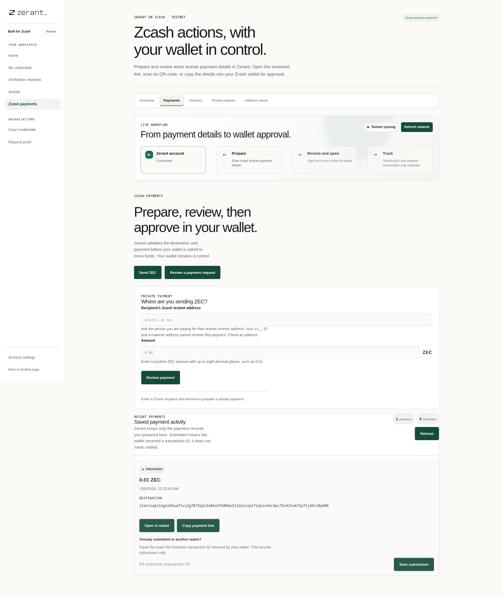

# Zerant Protocol

**Prove trust. Preserve privacy.**

Zerant is a trust and credential layer for applications in the Zcash ecosystem. An organization issues a signed statement to a person's private Zerant vault. Another organization can request one specific fact, and the holder decides whether to disclose it. Zcash payments are a separate action: Zerant prepares and tracks a request, while a wallet keeps the spending keys and asks for its own approval.

Zerant is running on **Zcash testnet**. A Zerant ID (`zr_…`) is an account identifier, not a payment address or a record of wallet activity. A passkey opens the trust workspace. Payment requests leave Zerant as reviewed ZIP-321 data for approval in an external wallet.

## How it works



The verifier receives the approved result, not the holder's credential collection. A credential is meaningful within its issuer, claim, and context; Zerant does not calculate a public reputation score. The current proof mechanism uses signed minimal disclosures and separate atomic attestations. It is **not** a zero-knowledge or anonymity system.

Payments follow a different authority path:



A wallet-returned transaction ID means **submitted**, not paid or settled. The hosted testnet observer can report network status and confirmation depth for a named transaction, but it cannot independently prove a shielded recipient and exact amount. Zerant does not issue a verified payment claim from that status alone. The normal payment flow uses a reviewed ZIP-321 link or QR code without a browser wallet connection. A simple single payment also shows the exact recipient and amount for manual entry in a testnet wallet; richer requests retain the complete link.

For organization payouts, a holder can separately share a **temporary private payout destination**. Zerant validates that it is shielded-capable on the configured Zcash network, encrypts the address and purpose under a payout-specific envelope-encryption domain, and reveals it only to authorized operators of the selected issuer organization while an active trust relationship exists. The organization inbox itself does not receive the address in its listing response. An authorized operator can enter the amount directly on that private payout record; Zerant decrypts the destination server-side, creates the canonical ZIP-321 request, and saves the normal prepared-payment record without placing the private address in a URL. The exact recipient is then reviewed in the standard payment surface before any wallet action. The address expires after seven days or can be withdrawn earlier; expiry, trust revocation, and trust expiry scrub the encrypted secret. A payout destination is not a Zerant identity attribute, credential claim, spending authorization, or custodial account.

## Architecture



The private service owns sessions, authorization, encrypted credential records, issuer and verifier workflows, payment records, and proof validation. The Zcash integration crate owns address, ZIP-321 and bounded observation rules. The external wallet keeps spending keys and payment approval. Zerant never equates payment authority with account access.

## Product walkthrough

Real production states from the current testnet workflow:

<table>
<tr>
<td width="50%"></td>
<td width="50%"></td>
</tr>
<tr>
<td><strong>Private vault</strong><br/>A Zerant ID receives trust credentials without becoming a payment address.</td>
<td><strong>Exact consent</strong><br/>The holder sees who is asking, why, and the single claim that can leave the vault.</td>
</tr>
<tr>
<td></td>
<td></td>
</tr>
<tr>
<td><strong>Bounded verifier result</strong><br/>The verifier receives the approved fact, not the holder's full credential or wallet history.</td>
<td><strong>Zcash payment handoff</strong><br/>Zerant validates and reviews the exact request before external-wallet approval.</td>
</tr>
</table>

**Watch the [full 2:57 narrated Zerant walkthrough](docs/assets/demo/zerant-demo-full.mp4)**, or the [36-second silent visual preview](docs/assets/demo/zerant-demo-preview.mp4). Both use real production browser captures with illustrative cursor and camera transitions; the full version includes synthesized narration and subtitles. Neither is a continuous wallet-transaction recording or proof of settlement. See [docs/DEMO.md](docs/DEMO.md) for the interactive demo script.

### Repository layout

```text
apps/web/                 Next.js product, public pages, components, server proxy routes
services/zerant-api/      Private Rust/Axum API, PostgreSQL persistence and migrations
crates/zerant-core/       Identifiers, canonicalization and common validation
crates/zerant-credential/ Signed credentials, issuer trust and revocation
crates/zerant-policy/     Contextual policy evaluation
crates/zerant-disclosure/ Requests, consent-bound responses and replay rules
crates/zerant-zcash/      Addresses, ZIP-321, payments and Zcash network boundaries
docs/                    Architecture, privacy, threat model and protocol specs
fixtures/                Shared protocol fixtures
scripts/                 Validation and operational helpers
```

The main workspace routes are `/app`, `/vault`, `/requests`, `/activity`, `/zcash`, `/issuer`, `/verifier`, and `/account`. Long operational areas use direct routes: `/zcash/payments`, `/zcash/invoices`, `/zcash/payouts`, `/zcash/address`; `/issuer/team`, `/issuer/schemas`, `/issuer/issue`, `/issuer/payouts`, `/issuer/security`, `/issuer/activity`; and `/verifier/requests`, `/verifier/integrations`, `/verifier/security`. The old `/zcash/wallet` link redirects to payment review. `/issuers` is the public issuer directory; `/pay/[id]` displays a bounded public invoice request. A public invoice does not identify its owner or certify payment.

## Wallet handoff on testnet

Sign in with a passkey. For a Zcash payment, Zerant validates the network, recipient and exact amount, then shows the complete ZIP-321 request as a link and QR code. Open it in a compatible **testnet** wallet, or copy the exact details for a simple payment. The wallet approves and submits the transaction outside Zerant. No browser-wallet connection is part of the normal product flow. Zerant never requests a seed phrase, spending key, wallet balance, or transaction history for identity.

### What the Zcash building blocks mean

| Building block | Role in Zerant | Current boundary |
| --- | --- | --- |
| Zcash wallet/developer RPC | Private service-side readiness, capability discovery and narrowly bound observation | Never exposed to the browser; an RPC response is not settlement proof |
| ZIP-321 payment URI | Portable payment handoff containing the exact reviewed recipient, amount and optional memo | Supported now; the complete request is preserved and handed to a compatible wallet |
| PCZT | A reviewable transaction package boundary for future wallet and shared-approval work | Parsed or documented where supported; not a Zerant spending key or settlement claim |
| FROST | Future shared approval for an organization or treasury | Not a live Zerant signing product; no shares are stored in the credential vault |
| Account abstraction | A possible future wallet product, not an identity shortcut | Zerant IDs do not control funds; making them spend would require an explicit custodial or smart-wallet design |

Zerant does not depend on WalletConnect or Noir. Historical adapters remain isolated in source for compatibility research; the product path is the reviewed ZIP-321 handoff.

## Run and verify

Use Node **22.x** and pnpm **10.34.6** for the web workspace. Rust tooling and a PostgreSQL database are needed for the private service; see [deployment and configuration](docs/VERCEL_DEPLOYMENT.md) for its server-only settings.

```bash
pnpm install --frozen-lockfile
pnpm --filter @zerant/web dev

pnpm --filter @zerant/web test
pnpm --filter @zerant/web lint
pnpm --filter @zerant/web typecheck
pnpm --filter @zerant/web build

cargo fmt --all -- --check
cargo clippy --workspace --all-targets -- -D warnings
cargo test --workspace
python3 scripts/secret-check.py
```

The browser adapter regression script remains in `scripts/browser-wallet-smoke.mjs` for historical compatibility checks; it is separate from the current payment flow.

The deployed web app reaches the Rust backend through private Vercel service binding and same-origin `/api/zerant/*` routes. Do not put database, RPC, or key configuration in `NEXT_PUBLIC_*`. The health endpoint is `/api/zerant/health`.

## Privacy and limits

Zerant stores credentials and workflow state on the server under its existing envelope encryption architecture. It keeps Zerant identity separate from wallet addresses and limits verifier results to the approved claim. Active private payout destinations use a distinct encryption domain, are organization-scoped, are included in holder data export while active, and are scrubbed on withdrawal or expiry. Issuer honesty, device compromise, traffic correlation, and coercion remain outside what signed minimal disclosure can solve. Pairwise identifiers reduce obvious cross-application linking but do not guarantee unlinkability.

The production configuration remains on **testnet**. Network readiness is not a payment receipt. Exact shielded settlement verification for hosted testnet payments requires an authorized recipient-side observation path and is not currently asserted by Zerant. PCZT and FROST code marks capability boundaries; it is not a live shared-control signing product.

For the detailed security contracts, read [architecture](docs/ARCHITECTURE.md), [protocol](docs/PROTOCOL.md), [privacy](docs/PRIVACY.md), [threat model](docs/THREAT_MODEL.md), [wallet compatibility](docs/WALLET_COMPATIBILITY.md), and [Zcash integration](docs/ZCASH-INTEGRATION.md).
