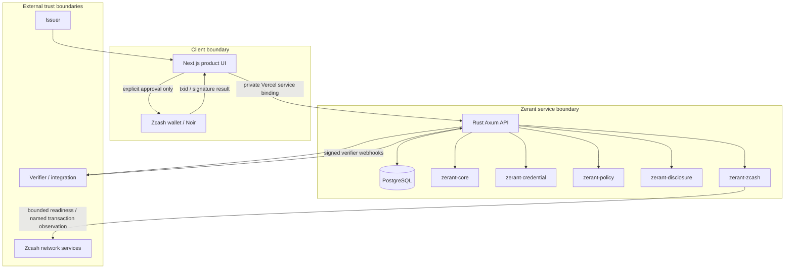

# Architecture

Status: active implementation architecture. The Rust protocol crates and public web console described below exist; future boundaries are labeled explicitly.

## Architecture at a glance

### Request and payment separation

A normal trust request never requires a wallet. The holder authenticates to Zerant, reviews the verifier's narrow request, and either approves or denies it. Approval re-verifies the private source credential and produces a verifier-specific response.

A Zcash payment is a separate action. Zerant validates and records the exact payment request; a compatible wallet retains the spending keys and performs the transaction only after its own approval. The wallet result is recorded as **submitted** until a trusted observation path establishes stronger network state.

The normal product has no browser-wallet connection state. Passkeys open Zerant; reviewed ZIP-321 links, QR codes, and exact copied details hand a payment to an external Zcash wallet. Wallet-derived account methods already linked by existing users remain removable under the current access-method safeguards, but new wallet pairing is not offered in account or payment navigation. Server-side Zcash network readiness and exact named-transaction observation remain separate from wallet authorization and never prove shielded recipient or amount by themselves.

### Database migration startup boundary

The API records applied schema migrations in `zerant_schema_migrations`. Under one PostgreSQL advisory lock, it applies each new migration and records its name in the same transaction. Historical migrations are never replayed on a populated database: older audit constraints cannot safely be restored after newer event types have been written. For deployments created before this ledger, startup recognizes only the final schema markers of the recent invoice and private-payout migrations and records the corresponding contiguous baseline. An unfamiliar partially migrated legacy schema fails startup for operator review rather than guessing which changes ran. This ledger contains schema names and timestamps only; it does not change credential, consent, payment, or retention data.

### Security ownership

| Boundary | Owns | Explicitly does not own |
| --- | --- | --- |
| Browser | UI state, consent interaction, reviewed payment handoff | durable credential authority, wallet keys |
| Rust API | authorization, challenges, workflow state, encrypted credential access | wallet seed/spending keys |
| Protocol crates | canonicalization, signature/replay/policy rules | user sessions or UI |
| Wallet | spending keys, transaction approval | Zerant identity/credential portfolio |
| Verifier | its request and approved result | holder's full credential collection |
| Network observer | bounded chain/readiness or named-tx evidence | account identity or general wallet history |

## Current monorepo

| Boundary | Responsibility |
| --- | --- |
| apps/web | Customer product surfaces for credentials, issuers, verifiers, consent and Zcash review |
| services/zerant-api | Authenticated account state, protected credential storage, issuer/verifier workflows and native integrations |
| crates/zerant-core | Strict parsing, origin/time rules, IDs and canonicalization |
| crates/zerant-credential | Credential signing/validation, issuer trust and revocation snapshots |
| crates/zerant-policy | Deterministic contextual policy evaluation |
| crates/zerant-disclosure | Signed verifier requests, holder responses, binding and replay contracts |
| crates/zerant-zcash | Zcash address/payment parsing, Z3/Zallet observation, PCZT/FROST capability boundaries |

The browser is a product and consent surface, not the protocol authority. Durable credential, session, issuer and verifier state is held by the service. Protocol-critical signing and verification reuse the Rust crates so the web layer does not implement a second version of the security rules.

Issuer governance actions are written to an append-only `issuer_events` ledger in the same PostgreSQL transaction as the protected change. Owners, admins and auditors can review the paginated organization history from the issuer workspace.

The issuer UI snapshots the recipient Zerant ID, active credential type, claim,
context, and validity for a separate review step before issuance. Editing returns
to the draft. The service still rechecks issuer role, recipient existence, type,
claim bounds, and signing authority at issuance; the UI review is an error
prevention step and never grants authority. It requests no wallet information.

## Load-bearing decisions

### Private organization-scoped payout destinations (2026-10-07)

A Zcash receive address is payment routing data, not Zerant identity. An authenticated holder may explicitly share one shielded-capable destination with one active issuer organization for a short stated payout purpose, but only while that issuer has a current non-revoked credential relationship with the holder. The service validates the configured Zcash network and rejects transparent-only destinations for this privacy-preserving flow. The address and purpose are encrypted together under the separate `payout-destination` envelope-encryption domain and are never added to credentials, public issuer metadata, or generic verifier results.

Only the holder and organization members with owner, admin, or issuer responsibility can retrieve an active destination. Auditors do not receive the private payload. The organization inbox never sends the private address to its listing UI and never puts it into a URL. An authorized operator sees only the scoped payout reference and purpose, then can enter an amount against the active record. Zerant decrypts the destination server-side, creates the canonical ZIP-321 request, and saves it through the existing account-scoped prepared-payment tracker. The exact recipient becomes visible in that normal payment-review surface before any wallet action. Preparation still does not move funds or grant wallet authority. New submissions to retired issuers are rejected.

At most one payout destination may be active for a holder/organization relationship at a time, enforced by a partial unique database index so concurrent submissions cannot create ambiguous payment routing. An active destination expires after seven days and can be withdrawn sooner. If the underlying issuer credential relationship is revoked or expires first, Zerant also expires and scrubs the payout secret so payment-routing access cannot outlive the trust relationship. Expiry and withdrawal null the ciphertext, nonces, wrapped DEK, and key version; the retention job performs expiry scrubbing even if neither party revisits the UI and deletes dead lifecycle metadata after 30 days. The payout family participates in vault-key rotation under its own AAD scope, account deletion cascades its rows, and active records appear in the holder's recent-authentication data export. Audit ledgers store lifecycle metadata only, never the address or purpose. Organization-facing payout records and payout lifecycle events do not expose the holder's reusable global Zerant ID; the payout record is the relationship-specific reference.

### Resume a prepared Zcash payment (2026-10-05)

An authenticated account may reopen only its own unexpired prepared payment.
The service derives a ZIP-321 URI from the already stored recipient and exact
integer zatoshis, then returns it only if its canonical digest equals the digest
stored at preparation. The URI is omitted after submission or expiry. This adds
no wallet history, spending authority, or new stored payment data; wallet action
remains explicit, and a returned transaction ID remains submitted, not settled.
Reopened transparent destinations retain a visible privacy warning and explicit
transparent action label.

### Holder proof preview binding (2026-10-05)

Before an authenticated holder approves a pending verification request, the
service returns a holder-only preview of the exact claim value and responsible
issuer selected under the request's issuer allowlist and credential context. The
preview includes the requester, authenticated origin, purpose, and expiry; it
returns no source credential, signature, wallet information, or other credential
history. The decision request must echo the previewed value and issuer ID. The
service repeats credential eligibility, revocation, request-expiry, audience,
issuer-trust, and replay checks, then rejects approval if the currently selected
value or issuer differs. Denial requires no preview and emits no proof. Preview
does not reserve consent, persist another credential copy, or grant the verifier
access. A changed request or available credential requires another holder review.

### Legacy injected-wallet connection research (not current product UI)

The following behavior documents retained adapter research and regression coverage from the earlier browser-wallet prototype. The current product does not expose this chooser, does not require Noir, and does not use a browser-wallet connection for account access or the standard payment flow.

The user-initiated Noir connection calls `zcash_requestAccounts` directly from the
wallet selection action. The selector loads Zerant's configured Zcash chain before
showing wallet choices, so selecting Noir does not perform another network fetch
before opening the wallet approval request. This keeps the approval-producing RPC
as close as possible to the user's click.

Silent `zcash_getAccounts` is reserved for explicit restoration and recovery logic.
Fresh connection discovery is passive: mounting the connection surface and opening the
wallet chooser do not request accounts or authorization. A rejected or closed
interactive approval is surfaced as that original wallet result; Zerant does not
immediately issue a second recovery RPC that could mask or race the approval lifecycle.
Starting a new explicit connection removes any listener from a previously connected
wallet before the interactive request, so old provider events cannot start silent
account refreshes during approval. An account lookup already in flight cannot
replace a newer wallet connection when it finishes. Noir instructions, permission reset, and
connection details are secondary disclosures in the UI; the chooser and its
approval result remain the primary path.
Connection grants only the wallet capabilities the user approves and never grants
Zerant sign-in or spending consent. No wallet balance, transaction history, or key is
persisted by this change. Testnet settlement remains unsupported without an authorized
named-transaction observer.

Direct browser wallet sessions are admitted only after the returned account
addresses identify the configured Zcash network locally. A mainnet Noir extension
may be detectable on a testnet site because the injected SDK has no safe preapproval
network query; detection is not compatibility. An unrecognized or mixed-network
account fails closed before Zerant offers wallet payment actions. This check reads
only the wallet's connection result in browser memory and never sends the addresses
to the service or persists them. It does not validate spending capability or prove
settlement. Other wallets may use the complete canonical ZIP-321 request without a
live connection; URI handoff is available only after server validation and exact
network matching. Adding arbitrary wallet providers requires reviewed adapters,
not broad discovery of browser globals.

### Discoverable passkey sign-in (2026-10-05)

Zerant may offer account sign-in without typing a Zerant ID when the device supplies a discoverable passkey. The WebAuthn challenge is generated and persisted by the service for five minutes using a distinct ceremony kind and a one-time HttpOnly attempt cookie. Its account UUID is a nil sentinel until the authenticator response identifies an account UUID and credential ID; the service looks up that exact account and stored credential, then validates the signed assertion with `webauthn-rs` before creating a session. The challenge is locked and consumed transactionally, and credential counter updates use the same path as account-selected passkey login. The existing Zerant-ID sign-in remains available for non-discoverable passkeys. This access change grants no wallet or payment authority and does not change credential subject binding, consent, key custody, revocation, or verifier replay handling. The service stores no additional identity or device profile data beyond the existing passkey record and short-lived ceremony.

### Server-backed Zcash payment tracking (2026-10-05)

Payment-request review rejects destinations on a network other than the configured Zcash chain, so a testnet review cannot hand off a mainnet destination.

The authenticated Zerant service owns a payment record for one validated, exact-amount ZIP-321 payment on the configured Zcash network. Preparation binds the account, a random record ID, SHA-256 of the canonical request, normalized recipient, integer zatoshis, and network. The canonical URI, memo, wallet account, balance, and history are not stored. Requests with multiple payments, unspecified amounts, memo, label, message, or extra parameters remain reviewable but cannot create a tracked payment in this profile. A submitted txid is bound once to the account-owned prepared record and is unique across records; retries with the same txid are idempotent. A wallet-returned txid is untrusted submission metadata, never settlement evidence. Only a future server-side named-transaction observer may advance beyond submitted; the existing native verified receipt path is regtest-only and must not be used to assert testnet settlement. Browser input never authorizes arbitrary transaction lookup.

Prepared records expire after 24 hours. The service lists only records owned by the authenticated account and deletes expired prepared records after 30 days; submitted records remain pending until a reviewed observation and retention policy is implemented. This interim retention favors preserving the sole pending payment reference over silently losing it. Future confirmation/credit needs a durable txid tombstone and explicit reorg/retention rules before any submitted record is deleted. This tracking does not change credential subject binding, consent, key lifecycle, revocation, or replay contracts. It creates account-to-payment metadata within the protected service, and therefore does not confer anonymity or unlinkability.

Testnet observation remains a separate trust boundary. [Lightwalletd's named `GetTransaction`](https://github.com/zcash/lightwalletd/blob/master/frontend/service.go) returns a raw transaction; this alone cannot reveal the recipient and exact amount of a shielded output. [Zallet's `z_viewtransaction`](https://github.com/zcash/zallet/blob/main/book/src/zcashd/json_rpc.md) is a wallet view and can include decoded outputs plus mined status and confirmations, but Zerant currently has no recipient viewing authority for arbitrary holder-initiated payments. A future payment issuer or recipient must explicitly supply an authorized, narrowly scoped viewing/observation service, and Zerant must verify its exact named transaction against the immutable request digest before advancing state. Do not turn general network readiness or a raw transaction lookup into settlement evidence; no testnet confirmation job is scheduled until this boundary is implemented and tested.

### Legacy connector registry (compatibility research)

The connector modules remain as reviewed compatibility research and regression coverage. They are not part of current product navigation. Passkeys are the product account-access path; ZIP-321 link/QR/exact-detail handoff is the product payment path.

The retained connector modules implement explicit capability contracts and network-safety regression tests. They never make connector metadata authoritative: the Rust service still owns challenge creation, signature verification, session redemption, and account linking, and no connector discovery state or wallet address is persisted as Zerant identity.

These modules are no longer a product-facing registry. The current signed-out Vault exposes passkey access only; the authenticated workspace exposes no persistent wallet connection state; and `/zcash/wallet` redirects to payment review. Existing ZecAuth or derived-wallet authentication records from earlier versions remain removable under the access-method safeguards, but new wallet pairing is not offered in current account or payment navigation.

WalletConnect remains excluded from product discovery, and no specific injected wallet defines Zerant compatibility. ZIP-321 is the current portable payment boundary. Retaining compatibility tests does not change credential subject binding, server storage, key lifecycle, revocation, replay handling, consent, or retention.

### Zcash sign-in identity linking

An account-link challenge is a separate purpose in the existing five-minute ZecAuth challenge store. Its row binds the target account UUID and initiating session UUID; neither is accepted from a signed callback or verification body. Issuance requires a session created within 15 minutes and sets a separate 256-bit link-attempt cookie (`HttpOnly`, `Secure`, `SameSite=Lax`); only its SHA-256 hash is stored. The cookie is distinct from the ordinary sign-in attempt. A wallet-app callback verifies the RedPallas signature for an unexpired, unconsumed link challenge and stores one bounded pending authentication public key on that exact row. It cannot create an account or session or link an identity. The first valid key wins; same-key retries are idempotent and a different key is rejected. The initiating browser completes with its exact attempt cookie and still-active, recent, matching session; the transaction consumes the challenge and clears the attempt cookie only after identity ownership and slot checks succeed. No account or session identifiers enter the wallet callback URL or request body. The injected-wallet path retains direct verification and the same transaction-bound session checks. Ordinary sign-in verification accepts only challenges without a link target, so responses cannot cross purposes. The session UUID is deliberately not a foreign key: deleting a session leaves an expiring challenge row, while completion fails closed because it must lock the live session with the same token, UUID, and account.

The identity tables retain one ZecAuth key per account and one derived wallet key per account/chain. Existing ownership by another account or a different key in the target slot causes conflict; matching keys are idempotent. Linking never updates the account's public handle. Raw authentication keys stay in the protected service database, and the account read model exposes only method, stored chain where applicable, and creation time. Challenges expire after five minutes and old rows follow the existing one-day cleanup. Session revocation/deletion, session expiry, and loss of recent authentication all fail closed. This is account authentication only: no wallet address, balance, history, seed or spending key is requested or stored. A compromised recent session plus control of an unlinked authentication key could add an access method, so session protection and short reauthentication age remain material controls.

### Payment authority and account abstraction boundary (2026-10-06)

The Zerant ID is an account handle for authentication and credential routing. It is not a spending key, a Zcash address, or a programmable wallet. Zerant therefore does not implement account abstraction by holding or deriving spending authority from a Zerant ID. A server-held signer would turn Zerant into a custodian and create a new high-impact key-recovery and compromise boundary; a browser-held signer would recreate the wallet problem under a different name. Passkeys remain sufficient for Zerant access, while a wallet or an explicitly chosen external wallet application remains necessary for a user-authorized payment.

Zcash developer RPCs are used only behind the private service boundary for bounded readiness, capability discovery, and named-transaction observation. RPC success is not payment settlement, and RPC credentials never reach the browser. ZIP-321 payment URIs are part of the product now: Zerant validates an exact request and lets the holder open or copy the complete request in a compatible wallet. FROST/shared-control and PCZT are documented capability boundaries for a later organization treasury or shared approval workflow; no Zerant ID payment and no live FROST signer are claimed here.

WalletConnect is not a supported product route. The hosted testnet product uses the portable ZIP-321 handoff as its payment boundary. Retained adapter code is compatibility research, not a prerequisite or visible connection state.

### Wallet-independent testnet payment handoff (2026-10-06)

The payment review presents its server-validated canonical ZIP-321 URI first. The holder can open it in an installed URI handler, copy it into a compatible testnet wallet, or scan a locally generated QR code. For a single exact-amount request without memo, label, message, or extra parameters, the page may also display and copy the validated recipient and exact decimal amount for a wallet that does not import ZIP-321. This manual route requires the holder to compare both fields in the wallet before approval; Zerant cannot enforce that another wallet sent the intended amount to the intended recipient. Complex requests never expose a reduced manual route because dropping a memo, second output, or required parameter changes the request. Every route keeps spending authority in the wallet. A transaction ID entered after external submission is account-bound submission metadata, not proof of settlement. No credential subject binding, consent, storage, issuer key lifecycle, revocation, replay, or retention contract changes.

The normal payment page does not request browser wallet connection. It asks the server to classify the destination before creating a request so a Zerant ID, an invalid address, and a wrong-network address have distinct user-facing outcomes. The server still validates the address, amount, and canonical request for preparation and persistence; the client check is guidance, not an authorization boundary. A saved prepared record remains required before the payment handoff. No injected-wallet route is exposed in current product navigation; `/zcash/wallet` redirects to `/zcash/payments`.

### Zcash sign-in identity removal

The account owner may delete the single ZecAuth identity or the wallet-message identity for an explicit testnet/mainnet chain using a session created within 15 minutes. Removal takes the account row lock before counting the current passkeys, ZecAuth identity and per-chain wallet-message identities; passkey removal uses the same lock. Both removal paths recheck that the exact initiating session is still active and recent under that lock, so a session revoked while waiting cannot delete another method. The target must exist and at least one access method must remain. The identity deletion and deletion of every `auth_method = 'zcash'` session for that account commit together. Sessions do not record the specific Zcash key/chain that authenticated them, so all Zcash sessions are conservatively revoked; passkey sessions remain. A removed current Zcash session receives a clearing session cookie. This changes only account authentication state, not the public handle, credentials, memberships, or payment authority. Rotation requires another access method, explicit removal, then an explicit link under the existing ownership/conflict rules. Removed authentication keys have no tombstone and may later be used under ordinary sign-in/linking rules; removal does not revoke any wallet spending key.

1. **Minimal disclosure through atomic attestations.** A normal signature cannot survive deleting signed claims. Private source credentials stay local. Separately signed audience-bound attestations carry one result. This is signed selection, not cryptographic selective disclosure or ZK.
2. **Threshold trust.** A trusted issuer evaluates its own evidence under the same pinned policy and signs a boolean. Holder computation gives transparency, not a verifiable hidden-input predicate. No issuer receives a complete holder portfolio. Supporting other issuers' aggregation requires a new trust/privacy design.
3. **Subject and audience binding.** Each account has a protected credential key for private source credentials. Approved presentations use a separate protected holder key scoped to the verifier relationship, so two verifiers do not receive the same stable holder proof key. This reduces direct cross-verifier correlation but is not a full unlinkability guarantee.
4. **Server credential vault.** `/vault` is backed by `zerant-api` and PostgreSQL. Every credential uses a fresh random AES-256 data key; the payload ciphertext is stored with that DEK wrapped by a versioned server key-encryption key. Sessions use opaque random tokens stored only as hashes and delivered as HttpOnly secure cookies. Browser storage is not a source of truth. The KEK is server-only and is designed to move behind a managed KMS/HSM in production. Zcash seeds, spending keys, PCZT artifacts and FROST shares are outside this vault.

### Service vault KEK migration decision

The existing v1 data and wrap AAD both bind the account, record ID and KEK version. A wrapped-DEK-only update would invalidate the data authentication tag. Rotation therefore decrypts and re-encrypts each record with a fresh DEK and nonces under the active version, retaining the existing on-disk format. An operator-only maintenance command changes at most one bounded PostgreSQL row-locking batch per invocation. It covers credential envelopes, account credential keys, issuer profiles and signing keys, verifier profiles and signing keys, holder pairwise keys, verifier webhook secrets, and approved verification responses. The command derives each AAD account from the same ownership relation as runtime decryption. A failed decrypt or write rolls back the batch; historical KEKs remain available until a zero-reference inventory is verified after all writers use the new active version. Plaintext and key material never enter output or logs. This trades additional data encryption work and a brief row lock for no format migration or dual-AAD compatibility mode. Concurrent writes can create old-version rows until every service instance has switched; the final inventory is therefore an operational gate, not a cryptographic proof against a later stale writer.
5. **Revocation is issuer-authoritative.** Issuers maintain a monotonic revocation version and revoked credential digests. Proof construction signs the current snapshot and revoked credentials are excluded immediately. Public signed snapshots are cached and published through the bounded issuer-discovery surface; production cache/CDN behavior and key custody still require operational hardening.
6. **Durable replay state.** Verifier owns pending requests and atomically consumes them after full verification; expiry and restart rules are in disclosure spec.
7. **No generic wallet identity.** No wallet addresses, balances or transactions enter generic schemas.

## Zcash boundary

Zcash remains isolated behind `zerant-zcash`; generic credentials and contextual policies do not depend on wallet state. The current adapter is regtest-oriented and read-only: it can discover the local Z3 RPC contract and project minimal Zebra/Zallet readiness without exporting balances, addresses, seed fingerprints or transaction history. The official Z3 regtest router has been exercised for read-only capability/status calls; no payment-send path is enabled.

Any future wallet-identity or payment authorization feature must separately define possession, observability, confirmation/reorg policy and key separation. [zcashd is deprecated](https://z.cash/support/zcashd-deprecation/); do not assume its retired embedded-wallet RPCs. Using Zcash tooling does not confer Zcash transaction-privacy properties on Zerant credentials.

## Decision gate before code

Validate maintained JOSE/JCS and server envelope-encryption compatibility, finalize exact public metadata contracts, and record KEK rotation/KMS and storage implementation choices here. Preserve the contracts below or explicitly version a change; unresolved library choices are not permission to weaken disclosure or replay rules.

## Issuer key lifecycle

Issuer signing authority is versioned instead of being replaced in place. Every issued credential records the issuer key that signed it. Routine rotation retires the current key for new issuance while retaining it only for validating and revoking credentials it already signed until those credentials expire. A compromise replacement marks the affected key compromised, invalidates credentials signed by it, and activates a fresh key for future issuance.

Historical signing keys remain encrypted under the issuer account boundary and participate in the same vault-key versioning model as other protected records.

## Verifier key lifecycle

Verifier request signing authority is versioned. Every verification request records the verifier key that signed it. Routine rotation retires the current key for new requests while already-sent requests remain valid until their existing short expiry. If a verifier reports the current key compromised, Zerant marks that key compromised, immediately expires pending requests signed by it, and activates a replacement for future requests.

Holder approval always validates the request against the exact historical verifier key recorded on the request, so rotation cannot silently reinterpret an existing request.

## Product application (implemented)

The web application now uses authenticated service state for real credentials, issuer profiles, verifier profiles and consent requests. It contains no seeded credential or verification data. A holder can receive issuer-created private credentials, review short-lived verifier requests, approve or deny them, and use Zcash-native identity/payment review surfaces.

## M1B Rust credential core (implemented)

The first protocol-critical implementation now lives in Rust. `zerant-core` owns strict encoding, canonicalization, time, and origin primitives. `zerant-credential` owns atomic credential parsing, issuer trust, EdDSA/Ed25519 compact-JWS validation, audience/expiry checks, and signed revocation snapshots.

The cryptographic boundary uses maintained libraries: `josekit 0.10.3` for JOSE/JWS EdDSA and `serde_json_canonicalizer 0.3.2` for RFC 8785 payload canonicalization. Zerant does not implement Ed25519 or JWS itself. Protected JOSE headers are restricted to `alg=EdDSA`, exact `kid`, and exact message-specific `typ`; signed Zerant payloads are JCS canonical.

Account-visible issuance, revocation and verification lifecycle events are captured by append-only database triggers and exposed through bounded cursor pagination. Authenticated write rate limits are stored in PostgreSQL so quotas remain consistent across horizontally scaled service instances.

Credential definitions are immutable once used. Issuers publish a new database row for each version; the previous active version is retired and remains referenced by already-issued credentials and in-flight verification requests. Only one active version per issuer/credential meaning is available for new issuance and new verifier requests.

Issuer authority is organization-scoped rather than account-shared. One Zerant account can belong to one issuer organization at a time. The organization owner controls ownership transfer, owners/admins manage security and credential definitions, owners/admins/issuers may issue or revoke, and auditors are read-only. Invitations target Zerant IDs and require explicit acceptance. Ownership transfer preserves the public issuer identity while rewrapping issuer signing-key ciphertext under the new owner's authenticated encryption context; the previous owner becomes an admin member.

Public trust discovery exposes only organization-level verification material: issuer identity, public signing-key lifecycle, immutable credential-definition versions and signed revocation state. Directory enumeration is cursor-paginated and bounded. Holder IDs, recipients, credentials, sessions and wallet data are excluded by contract and regression tests.

Verifier integrations use separately revocable bearer credentials whose full secrets are shown once and stored only as SHA-256 hashes. Integration keys have explicit request-create/read scopes and optional expiry. Machine request creation reuses the same account-scoped request core as the signed-in verifier dashboard and requires immutable managed credential definitions. Browser sessions are not forwarded through the integration proxy.

Protocol-critical logic remains native Rust. Contextual policy evaluation, disclosure v0.2/v0.3, replay persistence, issuer issuance, verifier requests, holder consent, verifier-scoped holder proof keys, audience-bound proof construction, payment-intent/settlement verification, the read-only Z3 transport, protected credential storage, ZecAuth authentication and server sessions are implemented. Production wallet spending, managed KMS/HSM custody, stronger unlinkable credential systems, exact shielded invoice-settlement attestation automation and live FROST signing remain future work. Shareable invoice-request automation is implemented, but it never promotes txid observation into a paid claim.

See [M1B implementation](specs/implementation-m1b.md).

## General-purpose executable boundaries (2026-10-04)

Policies remain immutable contextual rules, with bounded integer category weights;
OSS is one fixture among service, business, community, grant, marketplace, role and
payment examples. The evaluator requires caller-verified credentials against pinned
issuer trust and fresh signed revocation at the explicit evaluation time. Conflicting
IDs, foreign contexts/subjects and unsupported evidence fail unavailable. Local scores
are private calculations, never verifier proof.

Disclosure reuses the existing JOSE/JCS profile. A pinned verifier key authenticates a
single-result request; the caller separately supplies an authenticated transport origin.
Approval signs exactly one verified matching attestation with its audience subject key.
No source fallback, denial reason, score, wallet history or portfolio is transmitted.
Request policy digest is explicitly included to prevent immutable policy substitution;
this is the versioned disclosure v0.2 profile. Issuer authorization remains mandatory.
Keys and transport authentication remain application responsibilities; no vault is implied.

Replay stores register the exact signed request digest before delivery and atomically
consume only after every verification check. A SQLite implementation uses conditional
UPDATE for process/restart safety; no response bodies are stored. Expired rows may be
purged; absent state fails closed. Revocation watermarks must be persisted by callers.
SQLite is a necessary local persistence dependency for this requested replay boundary.

Zcash is isolated in zerant-zcash. Only regtest adapters are enabled here. Documented
read-only RPCs and OpenRPC discovery are allowlisted. Wallet RPC output is projected
into readiness/status without exporting fingerprints, balances or history. Payment
confirmation alone does not establish recipient, amount or invoice fulfillment; these
must be checked by an authorized issuer before signing a payment claim. No seeds are
accepted. Sending and production payment settlement are separate capabilities, enabled
only after a demonstrated supported contract. Optional organizational signing has an
interface only; no FROST algorithm or compatibility claim is implemented.

The browser playground uses shared public policy examples and transient consent state.
It is a simulation, not a native verifier, authenticated transport or encrypted vault.
No real credentials or wallet secrets are accepted; scenario changes reset consent.

## Policy and disclosure implementation contract (2026-10-04)

The native policy API accepts already-verified CredentialPayload values; callers must
verify issuer authorization, signature and fresh revocation at as_of before calling.
It rechecks structure, time, context, source schema, issuer and subject consistency.
It exposes a local count/exclusion summary without payloads or identifiers. Empty
evidence is zero; conflicts and invalid evidence are unavailable, never silently zero.
Weights may be zero; every rule has a nonzero bounded count. Supported thresholds
are unique safe integers within the cap (including zero); output sorts thresholds.

Disclosure v0.2 requires an immutable policy digest for threshold requests. Native
libraries accept pinned verifier trust and an independently authenticated origin;
they do not authenticate a browser session. Holder signing is a low-level operation
requiring application consent. Enrollment, key generation/rotation and encrypted
key storage remain application responsibilities; compromise flags reject known bad
keys. Issuer trust and signed revocation remain required at response acceptance.

Replay rows contain ID, exact ASCII request digest, origin, expiry and status only.
The exact signed request must additionally be retained by the caller and supplied
when verifying; its hash must match the persisted row. SQLite conditional updates
provide single acceptance across threads, connections and restart. Never overwrite
an existing request ID, even consumed or expired. No response bodies or scores are
stored. Caller-controlled deletion of expired rows must never restore old requests;
register only freshly issued, independently random IDs. Revocation watermarks and
clock health are caller responsibilities. No vault, authenticated browser transport
or transaction privacy is implemented by the policy/disclosure components.

The concrete regtest HTTP transport uses reqwest blocking HTTP without TLS (fixed
loopback router only), disables redirects and proxies, enforces a 15-second deadline
and 1 MiB response limit, and allowlists three read-only RPCs: rpc.discover,
getblockchaininfo and getwalletinfo. Authentication stays
inside the client and errors omit raw wallet responses. No remote endpoint or spending
method is exposed. A missing Zebra IBD field is unknown, never inferred ready/false.

## Observed payment condition boundary (2026-10-04)

Live discovery supports `z_viewtransaction`. The adapter now checks a single named
transaction against a caller-pinned recipient, minimum integer zatoshis and minimum
confirmations, rejects change/transparent/unknown outputs, and returns only success
or unavailable/error. This is local issuer evidence, not a signed receipt by itself.
The issuer must bind receipts to invoices, prevent double credit, and revoke/reissue
on reorgs. The explicit regtest helper exposes transparent coinbase funding and
shielded receipt; it does not weaken `FullPrivacy` to make fully shielded sends work.
No wallet seeds/keys, transaction IDs, addresses or memos are written to public
fixtures. Generic credentials do not acquire wallet dependencies.

## Compound disclosure / invoice lifecycle decisions

The v0.3 extension signs 2–8 ordered atomic request descriptions with identical
origin, purpose, challenge, nonce and validity. It keeps v0.2 unchanged and verifies
all issuer attestations with one audience subject key before consuming one durable
replay row. Payment requirements use payment.invoice_paid with the canonical intent
digest as context; approval requirements use the same ordinary attestation primitive.
Payment receipt observations remain native issuer evidence, never verifier proof.

Exact settlement checks sum only external shielded outputs to a pinned recipient.
The payment ledger retains only intent ID/digest, txid and lifecycle status, uses a
unique transaction constraint, and rejects stale/cancelled/expired observations.
A receipt requires a mined block identity/time and a fresh named-transaction query;
reorg revocation and invoice retention/deletion remain issuer responsibilities.
No whole-wallet response, participant secrets or PCZT bytes enter browser data.
SQLite reuses the existing maintained rusqlite dependency for durable single-credit
protection. No cryptographic profile, trust root or subject enrollment changes.

PCZT interfaces bind explicit review to the exact plan and intent digest; inspection
is creator-claimed metadata, not cryptographic proof. External adapters must validate
extracted transactions against their original proposals. Shared control delegates
approval verification to reviewed external tooling. Native HTTP remains read-only;
discovery alone never authorizes spending. FROST is an interface, not live signing.

### Legacy browser capability routing research

The repository retains detector, adapter, restoration, and direct-payment tests from the earlier browser-wallet prototype. They remain useful for interoperability research and regression coverage, but current product navigation does not expose provider discovery, connection state, or direct browser-wallet execution.

Passkeys provide current Zerant account access. Every validated payment retains its canonical ZIP-321 URI for external handoff; simple requests may also expose exact manual details after server validation. WalletConnect remains excluded from product discovery. External wallet submission is not settlement verification, and none of the retained compatibility code changes credential trust, consent, revocation, replay, or retention boundaries.

### Vault key-provider boundary

Envelope encryption is split into data encryption and data-key wrapping. VaultCipher owns the stable record/AAD contract while a VaultKeyProvider supplies the active wrapping-key version and versioned wrap/unwrap operations. The current concrete provider is the local AES-256-GCM keyring loaded from server-only deployment secrets. Rotation and all encrypted record families use provider methods rather than direct key-map access.

This boundary deliberately does not claim managed KMS/HSM custody yet. A future adapter can replace the wrapping provider while preserving existing ciphertext rows and version migration rules.
